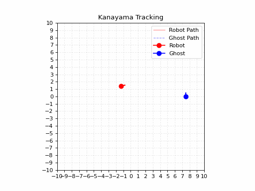
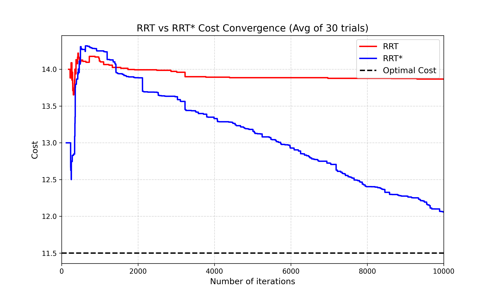
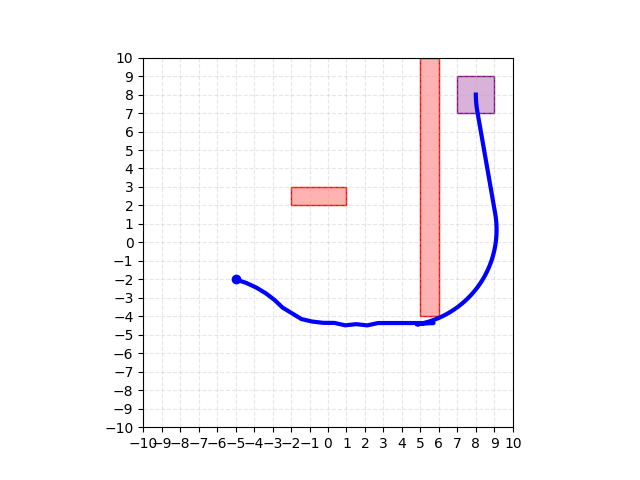
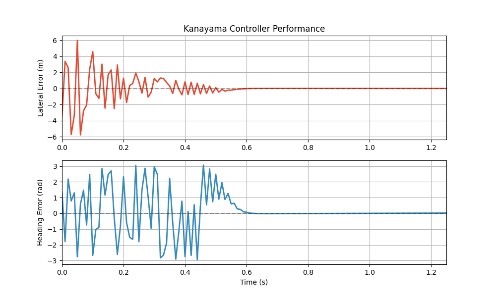
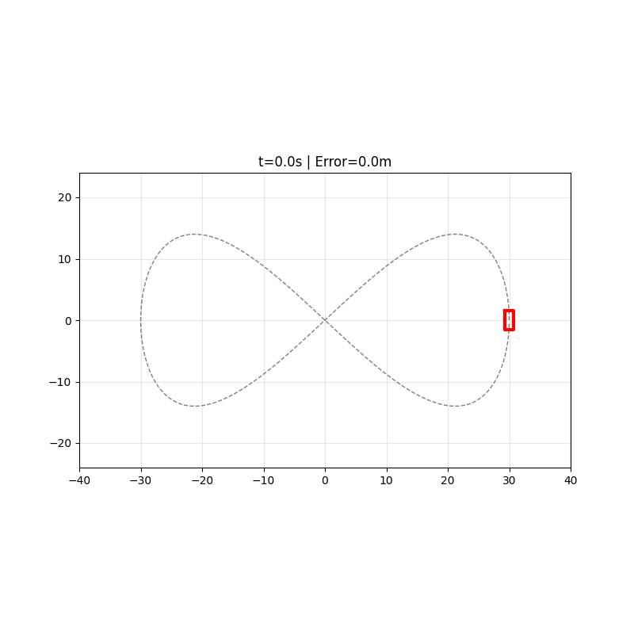
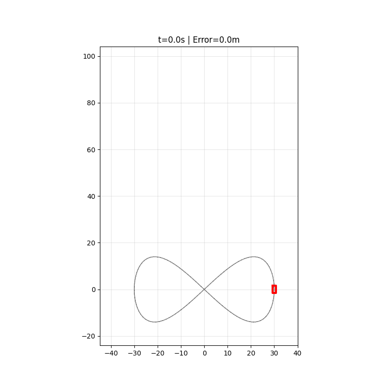
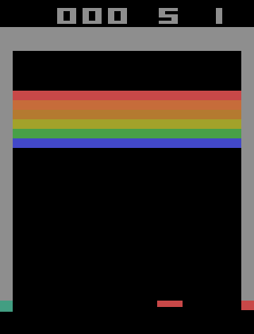
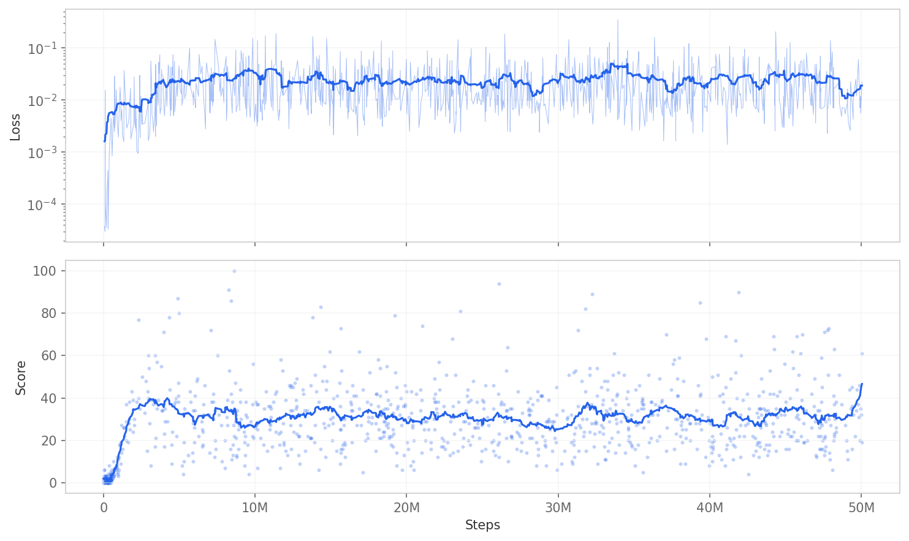
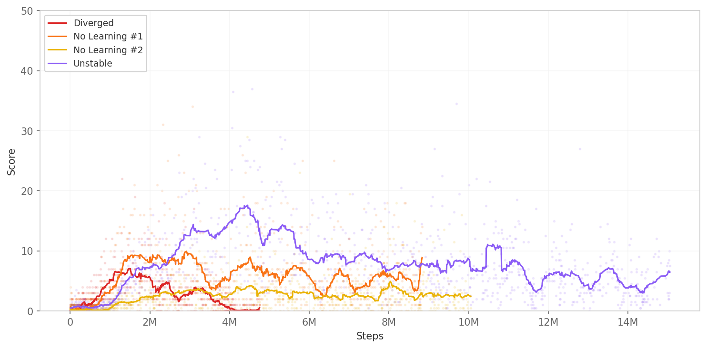

# Robotics Paper Replications

Implementations and experiment reproductions of classic robotics, planning, control, and reinforcement-learning papers.

## Visual Highlights

<table>
  <tr>
    <td width="33%" align="center"><strong>RRT* planning</strong></td>
    <td width="33%" align="center"><strong>Kanayama tracking</strong></td>
    <td width="33%" align="center"><strong>PPO on Breakout</strong></td>
  </tr>
  <tr>
    <td align="center"></td>
    <td align="center"></td>
    <td align="center"></td>
  </tr>
  <tr>
    <td>Explore, connect, then rewire toward shorter paths.</td>
    <td>Recover from pose error and lock onto a moving path.</td>
    <td>Learn control from pixels with clipped policy updates.</td>
  </tr>
</table>

## Path Planning

### RRT* — Karaman & Frazzoli (2011)

<table>
  <tr>
    <td width="46%" align="center"></td>
    <td><strong>RRT explores fast. RRT* keeps improving the route.</strong><br><br>RRT grows a tree by taking collision-free steps toward random samples. It can find a route quickly, but that route may wander.<br><br>RRT* gives every node a path cost. A new node chooses the cheapest nearby parent, then rewires neighbours when it offers them a shortcut. The tree straightens as sampling continues.<br><br><code>cd 01_RRT_Star_Karaman && uv run main.py</code></td>
  </tr>
</table>

Across 30 saved trials, RRT largely plateaus after finding a route; RRT* continues reducing cost over 10,000 iterations.

<p align="center"></p>

### Hybrid A* — Dolgov et al. (2008)

<table>
  <tr>
    <td width="46%" align="center"></td>
    <td><strong>A* finds a route. Hybrid A* finds one a car can drive.</strong><br><br>A grid path can demand impossible sideways motion. This search tracks <em>x</em>, <em>y</em>, and heading, then expands each node with forward and reverse bicycle-model steps.<br><br>An obstacle-aware grid heuristic guides the search; Reeds–Shepp distance accounts for steering limits and provides an analytic finish near the goal.<br><br><code>cd '05_HybridA*_Dolgov' && uv run main.py</code></td>
  </tr>
</table>

## Control

### Stable tracking control — Kanayama et al. (1990)

<table>
  <tr>
    <td width="46%" align="center"></td>
    <td><strong>Pose error becomes motion that pulls the robot back onto its path.</strong><br><br>The controller rotates position error into the robot's body frame, then turns longitudinal, lateral, and heading error into linear and angular velocity commands.<br><br>The robot starts displaced and misaligned. The animation shows it catching the reference; the plot shows lateral and heading error settling to zero.<br><br><code>cd 02_PID_Kanayama && uv run main.py</code></td>
  </tr>
</table>

<p align="center"></p>

### Model predictive control — Kong et al. (2015)

<table>
  <tr>
    <td width="50%" align="center"><strong>Low speed: success</strong></td>
    <td width="50%" align="center"><strong>High speed: model failure</strong></td>
  </tr>
  <tr>
    <td align="center"></td>
    <td align="center"></td>
  </tr>
</table>

The controller is identical in both runs: a 10-step, 0.1-second horizon linearized from a four-state kinematic bicycle model, with acceleration limited to −1.5/+1.0 m/s² and steering to ±37°.

- **Why the slow run works:** the 40-second reference travels at about 3.1–6.4 m/s. Slip remains small enough that the kinematic prediction approximates the dynamic Pacejka-tire simulation; saved mean position error is about 0.20 m.
- **Why the fast run fails:** the same curve is compressed into 10 seconds, making it four times faster—about 12.3–25.8 m/s. The simulated car develops lateral velocity and yaw dynamics, while Pacejka tire forces saturate and the vehicle understeers. The MPC still predicts with a model that has no tire-force, lateral-velocity, or yaw-rate states, so it cannot foresee that loss of lateral authority and tracking error compounds.

`cd 03_MPC_Kong && uv run main.py`

## Reinforcement Learning

### DQN / Double DQN — Mnih et al. (2015), van Hasselt et al. (2015)

<table>
  <tr>
    <td width="46%" align="center"></td>
    <td><strong>Learn which joystick action is worth most—directly from pixels.</strong><br><br>Four processed frames give the agent motion. A CNN estimates action values; one million replay slots break temporal correlation; a separate target network stabilizes learning.<br><br>Double DQN selects the next action with the online network but evaluates it with the target network, reducing optimistic value estimates. Saved checkpoints expose learning, degradation, and recovery rather than only the best run.<br><br><code>cd 04_DQN_Minh && uv run main.py</code></td>
  </tr>
</table>

<table>
  <tr>
    <td width="50%" align="center"><strong>Successful run</strong></td>
    <td width="50%" align="center"><strong>Failed and unstable runs</strong></td>
  </tr>
  <tr>
    <td></td>
    <td></td>
  </tr>
</table>

### PPO — Schulman et al. (2017)

<table>
  <tr>
    <td width="46%" align="center"></td>
    <td><strong>Improve a policy without letting one update move it too far.</strong><br><br>The agent collects fixed-length rollouts, uses generalized advantage estimation to assign credit, then reuses each batch for clipped policy updates. CNN policies handle Atari frames; Gaussian policies handle continuous actions.<br><br>Saved reproduction runs reach ~373 average return on Breakout and ~2700 on HalfCheetah—comparable to a strong reference implementation, not paper-beating.<br><br><code>cd 06_PPO_Schulman && uv run main.py</code></td>
  </tr>
</table>

<table>
  <tr>
    <td width="50%" align="center"><strong>Breakout — 10M steps</strong></td>
    <td width="50%" align="center"><strong>HalfCheetah — 1M steps</strong></td>
  </tr>
  <tr>
    <td></td>
    <td></td>
  </tr>
</table>

## Quick Start / Reproducibility

The repository uses Python 3.13 and [`uv`](https://docs.astral.sh/uv/) for dependency management.

```bash
git clone https://github.com/wnedov/Paper_Replications.git
cd Paper_Replications
uv sync

cd 01_RRT_Star_Karaman
uv run main.py
```

Run commands from the individual project directories so generated checkpoints, plots, and animations remain with the corresponding experiment. RL training is hardware- and seed-sensitive; the committed plots and evaluation summaries are retained as evidence of the reported runs.

## Repository Structure

```text
01_RRT_Star_Karaman/     RRT and RRT* planning
02_PID_Kanayama/         stable trajectory tracking
03_MPC_Kong/             constrained vehicle MPC
04_DQN_Minh/             DQN and Double DQN on Breakout
05_HybridA*_Dolgov/      Hybrid A* vehicle planning
06_PPO_Schulman/         PPO on Breakout and HalfCheetah
07_UKF_Uhlmann/          UKF reference papers
common/                  shared environments, models, networks, and trajectories
other/                   additional paper references
```

## Attribution / Provenance

The planning, control, and learning experiments are repository implementations of the cited methods, but not every component is written from scratch. In Hybrid A*, [`reeds_shepp_path_planning.py`](05_HybridA*_Dolgov/reeds_shepp_path_planning.py) is adapted from the [PythonRobotics Reeds–Shepp planner](https://github.com/AtsushiSakai/PythonRobotics/tree/master/PathPlanning/ReedsSheppPath); the upstream author attribution remains in the source file.

## References

- Karaman, S. and Frazzoli, E. (2011), [Sampling-based Algorithms for Optimal Motion Planning](01_RRT_Star_Karaman/RRT%2A%20-%20Karaman%20and%20Frazzoli.pdf).
- Kanayama, Y. et al. (1990), [A Stable Tracking Control Method for an Autonomous Mobile Robot](02_PID_Kanayama/PID_Kanayama_1990.pdf).
- Kong, J. et al. (2015), [Kinematic and Dynamic Vehicle Models for Autonomous Driving Control Design](03_MPC_Kong/Kong-2015.pdf).
- Mnih, V. et al. (2015), [Human-level Control through Deep Reinforcement Learning](04_DQN_Minh/Minh2015.pdf), and van Hasselt, H. et al. (2015), [Deep Reinforcement Learning with Double Q-learning](04_DQN_Minh/DoubleQ_Hasselt2015.pdf).
- Dolgov, D. et al. (2008), [Practical Search Techniques in Path Planning for Autonomous Driving](05_HybridA*_Dolgov/HybridA_Dolgov2008.pdf).
- Schulman, J. et al. (2017), [Proximal Policy Optimization Algorithms](06_PPO_Schulman/PPO_Schulman2017.pdf).
