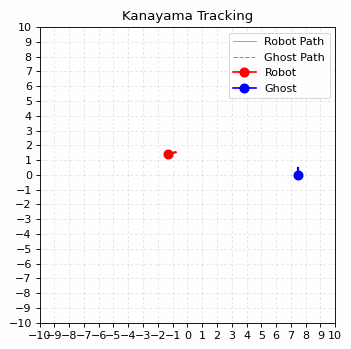
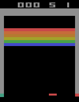
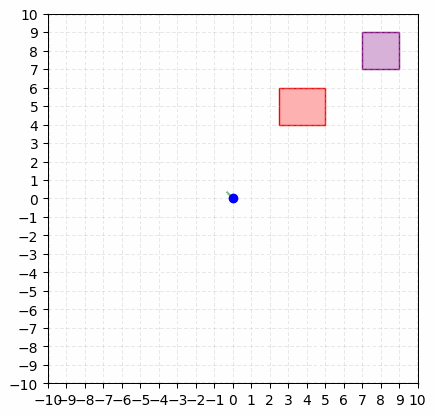
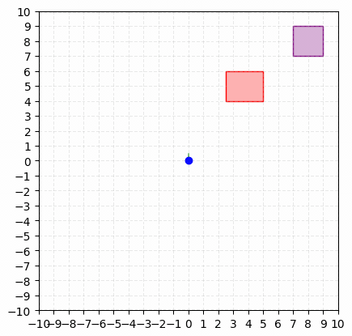
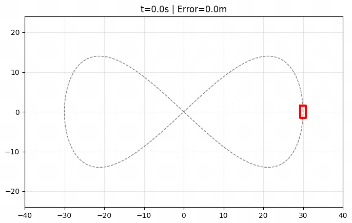
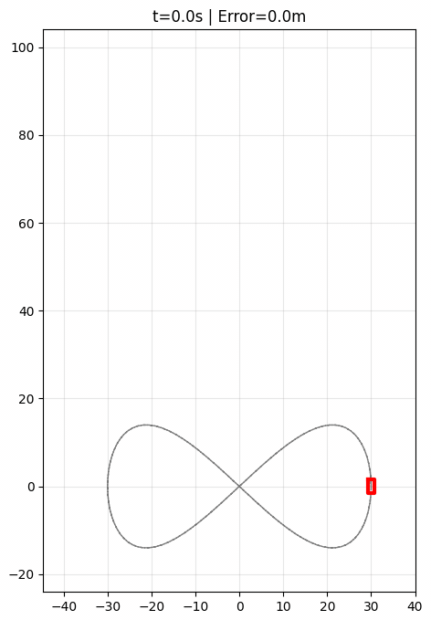
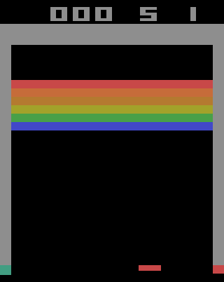

# Robotics Paper Replications

My implementations of classic robotics, planning, control, and reinforcement-learning papers.

## Highlights

<table>
  <tr>
    <td width="33%" align="center"><strong>RRT* planning</strong></td>
    <td width="33%" align="center"><strong>Kanayama tracking</strong></td>
    <td width="33%" align="center"><strong>PPO on Breakout</strong></td>
  </tr>
  <tr>
    <td align="center"></td>
    <td align="center"></td>
    <td align="center"></td>
  </tr>
  <tr>
    <td>Uses tree-like exploration to refine a path towards a goal.</td>
    <td>Recover from pose error and lock onto a moving path.</td>
    <td>Learning to solve breakout using RL.</td>
  </tr>
</table>

## Path Planning

### RRT* — Karaman & Frazzoli (2011)

<table>
  <tr>
    <td width="33%" align="center"><strong>RRT — 2,500 iterations</strong></td>
    <td width="33%" align="center"><strong>RRT* — 2,500 iterations</strong></td>
    <td width="33%" align="center"><strong>RRT* — 10,000 iterations</strong></td>
  </tr>
  <tr>
    <td></td>
    <td></td>
    <td></td>
  </tr>
</table>

<p align="center"><strong>Cost convergence over 30 trials</strong><br></p>

RRT is a sampling-based planner for continuous configuration spaces. Each iteration samples a collision-free point, finds the nearest tree vertex with a k-d tree, steers toward the sample by at most 0.5 units, and inserts the new vertex if the connecting edge is collision-free. Following parent pointers from a goal vertex produces a feasible path, but standard RRT does not optimize that path after insertion.

RRT* adds a cost from the origin to every vertex. For a new vertex, the implementation searches a neighbourhood and selects the collision-free parent that minimizes cumulative path cost, then rewires existing neighbours when routing through the new vertex lowers their cost.

`cd 01_RRT_Star_Karaman && uv run main.py`

### Hybrid A* — Dolgov et al. (2008)

<p align="center"></p>

Hybrid A* searches a discretized $(x, y, \theta)$ space while constraining transitions to those generated by vehicle dynamics. This retains A*'s graph-search structure without allowing transitions that a vehicle cannot execute. The heuristic is the maximum of an obstacle-aware 2D cost map and Reeds–Shepp path length.

`cd '05_HybridA*_Dolgov' && uv run main.py`

## Control

### Stable tracking control — Kanayama et al. (1990)

<p align="center"></p>

The Kanayama controller is similar to PID. It measures tracking error and feeds that error back into the control command. While a PID usually regulates one scalar quantity, this controller regulates a robot pose (position and heading) while the target is moving.

The position error is expressed in the robot's local frame and separated into forward, lateral, and heading components $(e_x, e_y, e_\theta)$.

A reference trajectory also supplies the forward speed and turn rate needed to follow the path. The controller then adds feedback corrections for the error terms above. The three gains determine how aggressively each error is corrected. When the pose error is zero, the robot follows the reference motion unchanged.

`cd 02_PID_Kanayama && uv run main.py`

### Model predictive control — Kong et al. (2015)

<table>
  <tr>
    <td width="50%" align="center"><strong>Low-speed dynamic simulation</strong></td>
    <td width="50%" align="center"><strong>High-speed dynamic simulation</strong></td>
  </tr>
  <tr>
    <td></td>
    <td align="center"></td>
  </tr>
</table>

Model predictive control chooses inputs by predicting how the car will move over a short horizon. Starting from the current state, it finds a sequence of acceleration and steering commands that follows the reference trajectory while respecting acceleration and steering limits. It applies the first command, measures the new state, and solves the problem again.

The controller predicts with a simplified four-state kinematic bicycle model: position, heading, and forward speed. It plans 10 steps at 0.1-second intervals and penalizes tracking error, control effort, and abrupt changes in control. Acceleration is limited to −1.5/+1.0 m/s² and steering to ±37°.

To test that simplified controller model, both animations apply its commands to the same, more detailed six-state simulated car. This dynamic model adds lateral velocity and yaw rate, and calculates lateral tire forces with a Pacejka model. Only the reference speed changes between the two experiments.

At approximately 3.1–6.4 m/s, the controller tracks with about 0.20 m mean position error. At approximately 12.3–25.8 m/s, the tires saturate and the car understeers. The controller cannot predict this loss of lateral force, so its planned motion no longer matches the simulated car and the tracking error grows.

`cd 03_MPC_Kong && uv run main.py`

## Reinforcement Learning

### DQN / Double DQN — Mnih et al. (2015), van Hasselt et al. (2015)

<table>
  <tr>
    <td width="33%" align="center"><strong>1M training steps</strong></td>
    <td width="33%" align="center"><strong>5M training steps</strong></td>
    <td width="33%" align="center"><strong>50M training steps</strong></td>
  </tr>
  <tr>
    <td></td>
    <td></td>
    <td></td>
  </tr>
</table>

<table>
  <tr>
    <td width="50%" align="center"><strong>Successful training run</strong></td>
    <td width="50%" align="center"><strong>Failed and unstable runs</strong></td>
  </tr>
  <tr>
    <td></td>
    <td></td>
  </tr>
</table>

DQN learns an action-value function $Q(s,a)$. Given the current screen state $s$ and a possible action $a$, $Q(s,a)$ estimates the  reward the agent can expect from taking that action and continuing to play. The network reads one state and outputs a value for every available action. During evaluation, the agent selects the action with the highest value; during training, $\epsilon$-greedy exploration occasionally replaces that choice with a random action. Each observation, which includes state, action, reward, and next state is stored in a replay buffer.

Training samples batches from that buffer and adjusts the predicted value toward the observed reward plus the estimated value of the next state.Double DQN separates action selection from action evaluation. It chooses one network to choose the best next action, while another network estimates its value. This reduces the risk of collapse when one network performs both.

`cd 04_DQN_Minh && uv run main.py`

### PPO — Schulman et al. (2017)

<p align="center"><strong>Trained Breakout policy</strong><br></p>

<p align="center"><strong>Learning curve over 10M training steps</strong><br></p>

PPO learns a policy $\pi(a\mid s)$. Given the current state $s$, it outputs a probability for each possible action $a$. In Breakout, a CNN reads stacked image frames and the actor samples an action from those probabilities. A critic processes the same state and estimates how much future reward remains available from it.

Training first collects short rollouts containing states, actions, rewards, and critic estimates. Generalized advantage estimation compares the observed rewards with the critic's predictions to estimate whether each action performed better or worse than expected. The update raises the probability of actions with positive advantage and lowers it for actions with negative advantage.

`cd 06_PPO_Schulman && uv run main.py`

## Quick Start / Reproducibility

The repository uses Python 3.13 and [`uv`](https://docs.astral.sh/uv/) for dependency management.

```bash
git clone https://github.com/wnedov/Paper_Replications.git
cd Paper_Replications
uv sync

cd 01_RRT_Star_Karaman
uv run main.py
```

Run commands from the individual project directories so generated checkpoints, plots, and animations remain with the corresponding experiment. RL training is hardware- and seed-sensitive; the committed plots and evaluation summaries are retained as evidence of the reported runs.

## Repository Structure

```text
01_RRT_Star_Karaman/     RRT and RRT* planning
02_PID_Kanayama/         stable trajectory tracking
03_MPC_Kong/             constrained vehicle MPC
04_DQN_Minh/             DQN and Double DQN on Breakout
05_HybridA*_Dolgov/      Hybrid A* vehicle planning
06_PPO_Schulman/         PPO on Breakout and HalfCheetah
07_UKF_Uhlmann/          UKF reference papers
common/                  shared environments, models, networks, and trajectories
other/                   additional paper references
```

## References

- Karaman, S. and Frazzoli, E. (2011), [Sampling-based Algorithms for Optimal Motion Planning](01_RRT_Star_Karaman/RRT%2A%20-%20Karaman%20and%20Frazzoli.pdf).
- Kanayama, Y. et al. (1990), [A Stable Tracking Control Method for an Autonomous Mobile Robot](02_PID_Kanayama/PID_Kanayama_1990.pdf).
- Kong, J. et al. (2015), [Kinematic and Dynamic Vehicle Models for Autonomous Driving Control Design](03_MPC_Kong/Kong-2015.pdf).
- Mnih, V. et al. (2015), [Human-level Control through Deep Reinforcement Learning](04_DQN_Minh/Minh2015.pdf), and van Hasselt, H. et al. (2015), [Deep Reinforcement Learning with Double Q-learning](04_DQN_Minh/DoubleQ_Hasselt2015.pdf).
- Dolgov, D. et al. (2008), [Practical Search Techniques in Path Planning for Autonomous Driving](05_HybridA*_Dolgov/HybridA_Dolgov2008.pdf).
- Schulman, J. et al. (2017), [Proximal Policy Optimization Algorithms](06_PPO_Schulman/PPO_Schulman2017.pdf).
